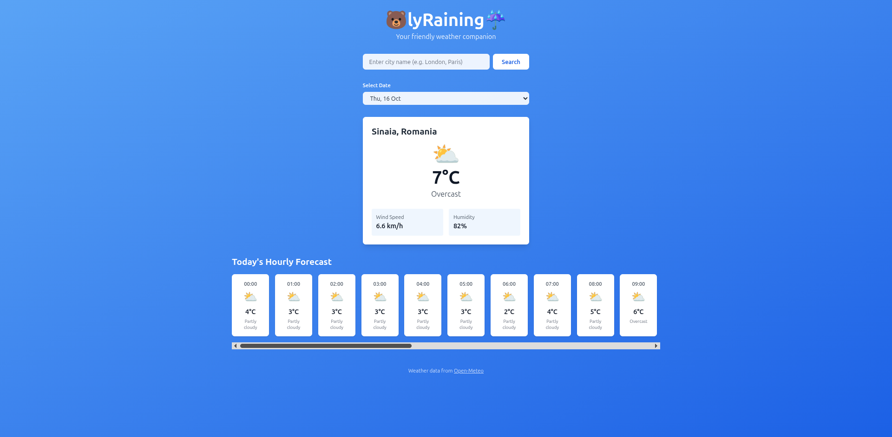

# 🐻lyRaining ☔

A modern, clean weather forecast application built with React, JavaScript, and Tailwind CSS. 

View current weather conditions and hourly forecasts for any location worldwide.



## Features

- 🌍 **Location Search** - Search for weather in any city worldwide
- 🌡️ **Current Weather** - Real-time temperature, conditions, wind speed, and humidity
- ⏰ **Hourly Forecast** - 24-hour weather forecast with detailed conditions
- 📅 **Date Selection** - View forecasts for up to 7 days ahead
- 📱 **Responsive Design** - Works seamlessly on mobile and desktop
- ⚡ **Fast & Lightweight** - Built with Vite for optimal performance

## Tech Stack

- **React** - UI component library
- **JavaScript** - Core programming language
- **Tailwind CSS** - Utility-first styling
- **Vite** - Build tool and dev server
- **Open-Meteo API** - Weather data provider (free, no API key required)

## Getting Started

### Prerequisites

- Node.js (v16 or higher)
- npm or yarn

### Installation

1. Clone the repository:
```bash
git clone https://github.com/Andipascale7/bearly-raining.git
cd bearly-raining
```

2. Install dependencies:
```bash
npm install
```

3. Start the development server:
```bash
npm run dev
```

4. Open your browser and navigate to `http://localhost:5173`

## Usage

1. **Default Location**: App loads with Carlisle, UK weather by default
2. **Search**: Enter any city name in the search box and click "Search"
3. **Date Selection**: Use the dropdown to view forecasts for different days
4. **Scroll**: Horizontally scroll through the hourly forecast cards


## Testing

Unit tests are included for all components using Jest and React Testing Library.

Run tests:
```bash
npm test
```

Run tests in watch mode:
```bash
npm test -- --watch
```

## API

This project uses the [Open-Meteo API](https://open-meteo.com/) for weather data:
- No API key required
- Free for non-commercial use
- Accurate, open-source weather forecasts

## Future Enhancements

- Save favorite locations
- Weather alerts and notifications
- Extended 16-day forecasts
- Weather maps visualization
- Dark mode toggle
- Weather jokes

## Author

**Andi Pascale**
- GitHub: [@Andipascale7](https://github.com/Andipascale7)
- LinkedIn: [Andi Pascale](https://linkedin.com/in/andipascale)

## License

This project is open source and available for educational purposes.

## Acknowledgments

- Weather data provided by [Open-Meteo](https://open-meteo.com/)
- Built as a technical assessment 